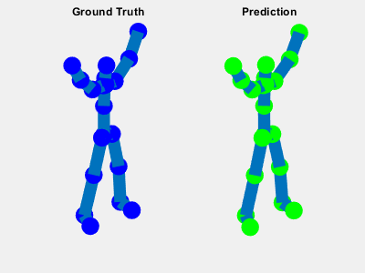

# R-FORCE
## Introduction
This repository contains the python and matlab code of implementing R-FORCE

## Abstract
We present a new initialization method for First Order Reduced and Controlled
Error [(FORCE)](https://www.sciencedirect.com/science/article/pii/S0896627309005479) to
achieve more robust performance to chaos. FORCE learning performs well only in a narrow
range of chaos, but we want to explore whether there exists alternative initialization
method which can make FORCE more robust. In this paper, we demonstrate how to generate 
R-FORCE specifically and show the comparison results of R-FORCE, FORCE and Full-FORCE() on
target-learning and multi-dimension body modeling tasks. This results imply R-FORCE outperforms 
other state-of-art methods in terms of mean absolute error and confidence interval simultaneously. 

## Predicted Modeling Video

## Training Instructions for One-dimension target funcion
* Run main.m for training, testing and plotting

## Training Instruction for multi-dimension body modeling
* We posted the original movement data(xxx.mat) and augment data(xxxPeriod.mat) in [**data**](data)
* Run mainRFORCEMovementSimulation.m for training and testing. The testing simulation result and
  ground truth is saved as Simulation_skel and skel, respectively.
* We also included a trained model and simulation results for deep squat inside [**result**](result)
* To visualize those results, you can use movementVisualization.m

## Citation

## License
